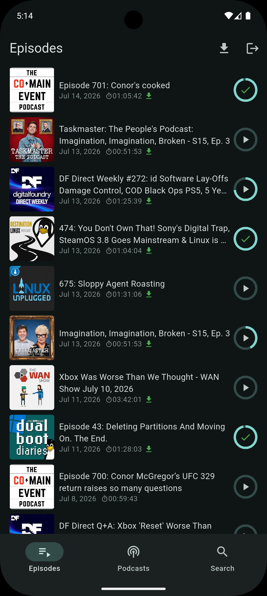
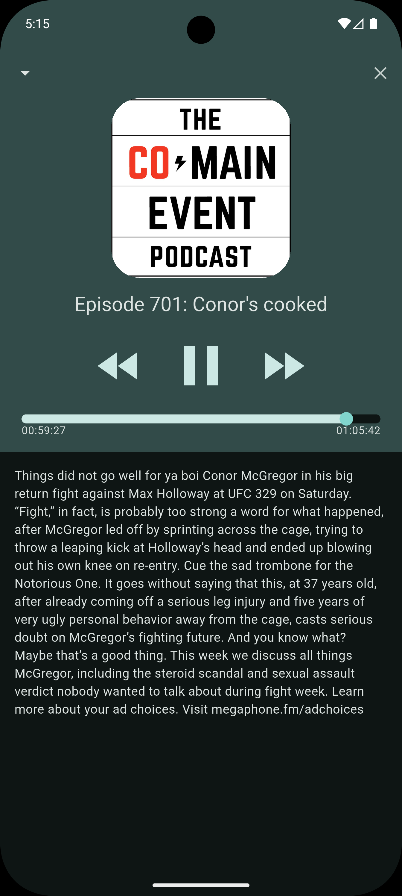
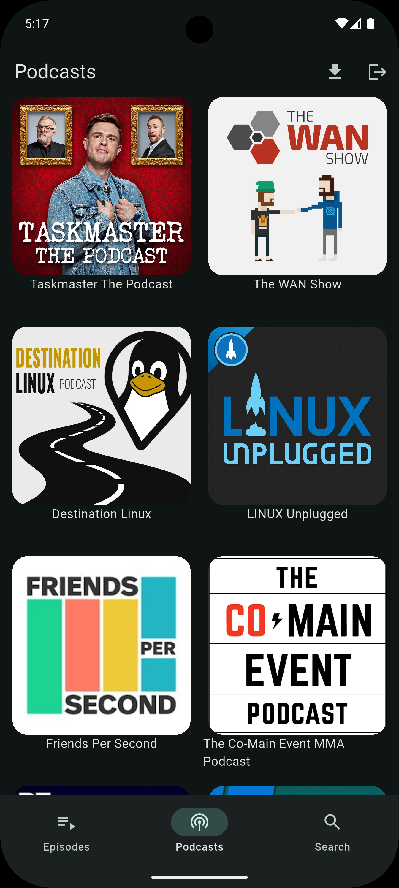
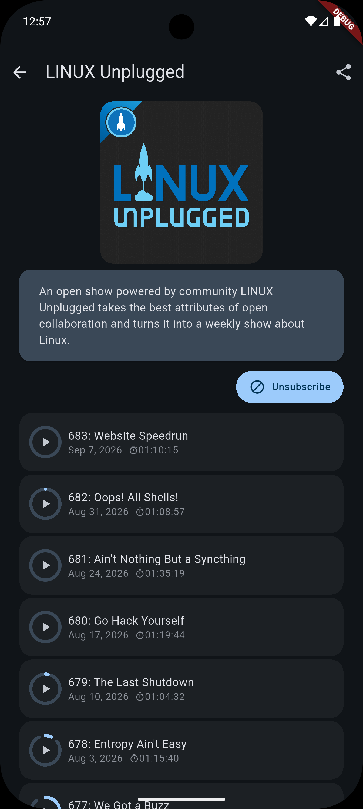
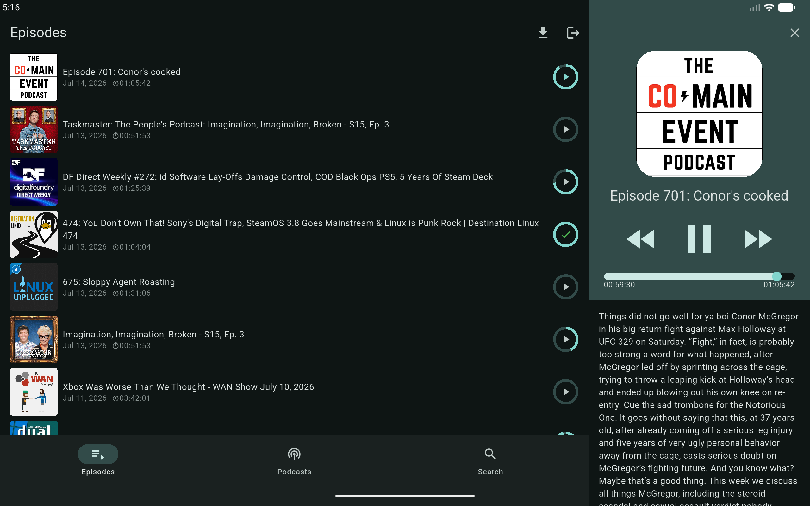
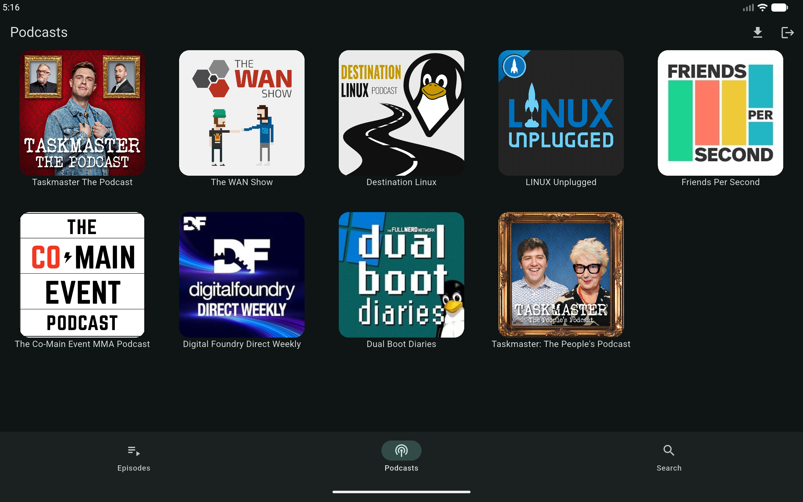

# Podku

Podku is a self-hosted podcast aggregator. Has a backend with a web and Android application front ends.

## Features

- Keeps track of episode play progress
- Podkunnect, similar to spotify connect, transfer audio to other devices running Podku (cli available as well)
- Implements some of the Podcast 2.0 features (trascripts and chapters mainly)
- Timestamped episode bookmarks with optional AI topic detection
- Optional episode transcript generation using a whisper server
- Search function that will also search through episode transcripts
- Android auto support (only when downloading from the Play Store)

## Screenshots

### Mobile

### Tablet / Desktop

